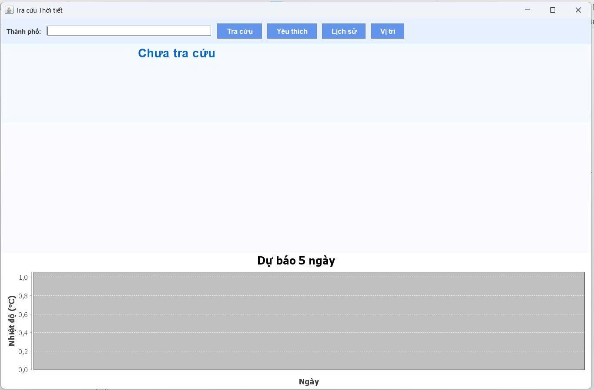
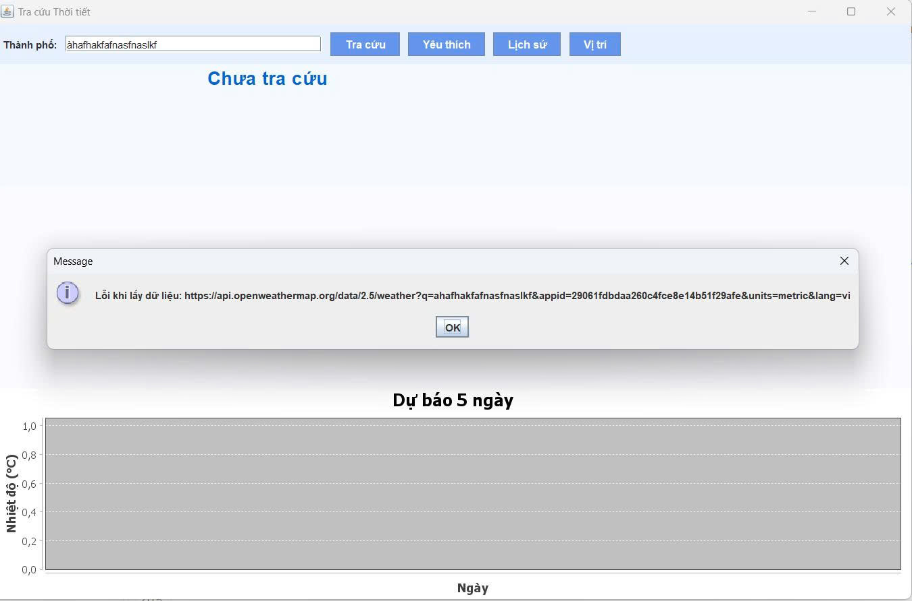
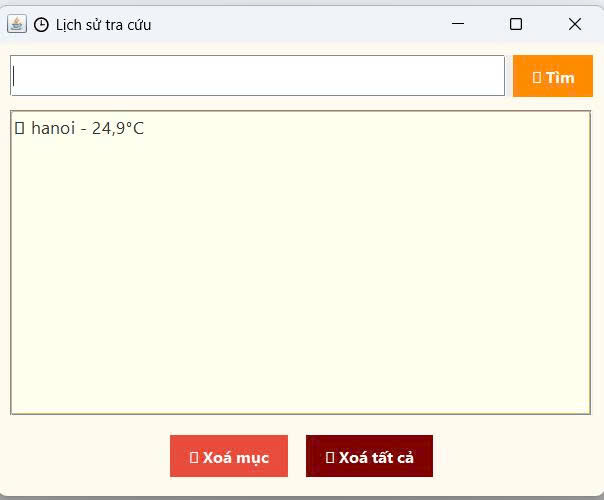
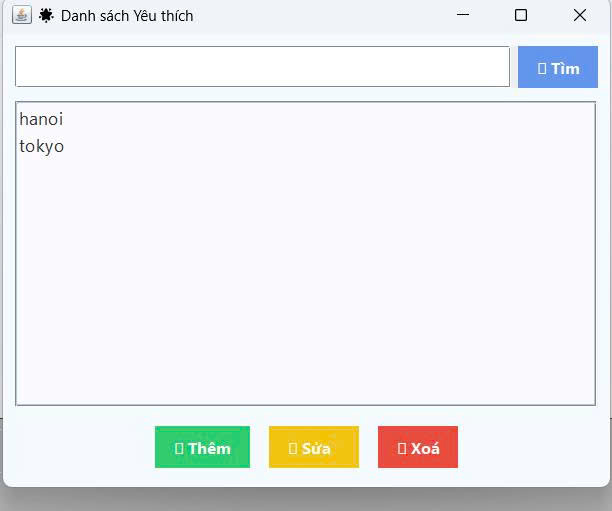

<h2 align="center">
    <a href="https://dainam.edu.vn/vi/khoa-cong-nghe-thong-tin">
        🎓 Faculty of Information Technology (DaiNam University)
    </a>
</h2>

<h2 align="center">
    ỨNG DỤNG TRA CỨU THỜI TIẾT ONLINE 
</h2>

<div align="center">
    <p align="center">
        
        
        
    </p>

[](https://www.facebook.com/DNUAIoTLab)
[](https://dainam.edu.vn/vi/khoa-cong-nghe-thong-tin)
[](https://dainam.edu.vn)

</div>

## 1. Giới thiệu hệ thống

🌦 Ứng dụng Tra cứu Thời tiết Online
📖 Giới thiệu đề tài

Trong thời đại công nghệ thông tin phát triển mạnh mẽ, nhu cầu nắm bắt thông tin thời tiết nhanh chóng và chính xác là rất cần thiết. Đề tài “Ứng dụng tra cứu thời tiết online” được xây dựng nhằm:

🏫 Minh họa mô hình Client – Server trong môn Lập trình mạng.

🌍 Kết nối và xử lý dữ liệu từ API OpenWeatherMap.

📱 Giúp người dùng nhập tên thành phố và nhanh chóng nhận được thông tin thời tiết.

📌 Giới thiệu dự án

Tên đề tài: Ứng dụng Tra cứu Thời tiết Online

Ngôn ngữ: Java

Chức năng chính:

Người dùng nhập tên thành phố.

Server gọi API OpenWeatherMap để lấy thông tin.

Hiển thị kết quả cho Client.
Ứng dụng vừa mang tính học tập, vừa có tính thực tiễn (tra cứu dữ liệu thời tiết thật).

👉 **Điểm nổi bật**:
- Người dùng có thể nhập tên thành phố và nhận thông tin thời tiết ngay lập tức
- Hỗ trợ nhiều thành phố trên toàn thế giới, dữ liệu cập nhật theo thời gian thực
- Giao diện client hiện đại với các thông báo trạng thái rõ ràng
## 🔧 2. Công nghệ & Ngôn ngữ sử dụng

[](https://www.java.com/)
[](https://docs.oracle.com/javase/tutorial/uiswing/)
[](https://www.weatherapi.com/)
[]()

**Chi tiết công nghệ:**
- **Java SE 11+**: Ngôn ngữ lập trình chính
- **Java Swing**: Xây dựng giao diện người dùng
- **Socket Programming**: Giao tiếp Client-Server qua TCP
- **HTTP Client**: Kết nối với WeatherAPI.com
- **JSON Parsing**: Xử lý dữ liệu JSON từ API (custom parser)
- **Multithreading**: ExecutorService cho xử lý đồng thời

## 🚀 3. Một số hình ảnh

### Giao diện chính của Client


### Kết quả tra cứu thời tiết

** Tra cứu thành công


** Lỗi không tra cứu được



**Lịch sử



** Yêu thích




## 📝 4. Các bước cài đặt

⚙️ Yêu cầu hệ thống:

```bash

Hệ điều hành: Windows 10/11, macOS, Linux

Java Development Kit (JDK): Phiên bản 8 trở lên
```
Bược 1: Cải đặt chi tiết
 ```bash
Cấu hình Eclipse

Import project Java vào IDE.

Đảm bảo project đang chạy bằng JDK, không phải JRE.

Thêm các thư viện cần thiết:

gson-x.x.x.jar hoặc json-x.x.x.jar (nếu dùng thư viện parse JSON).

Thêm vào: Project → Properties → Java Build Path → Add External JARs.
```
Bước 2: Cấu hình API Key
 ```bash
Mở file WeatherServiceImpl.java.

Thay dòng:

private static final String API_KEY = "YOUR_API_KEY";


bằng API key thật lấy từ [OpenWeather](https://www.weatherapi.com/login.aspx)
```
Bước 3: Chuẩn bị RMI Registry

Bạn có 2 cách để khởi động RMI Registry:
 ```bash
1. Khởi động ngoài terminal/cmd

Vào thư mục bin (chứa file .class) của project.

Chạy lệnh:

rmiregistry 1099


(Windows có thể cần: "C:\Program Files\Java\jdk-17\bin\rmiregistry.exe" 1099)
 ```
 ```bash
2. Tích hợp trong code

Trong WeatherServer.java, thêm:

LocateRegistry.createRegistry(1099);

Khi đó chỉ cần chạy WeatherServer, không cần mở rmiregistry bằng tay.
 ```
Bước 4: Chạy ứng dụng
 ```bash
1. Khởi động Server

Mở file WeatherServer.java.

Run → Java Application.

Console in ra:

✅ WeatherServer is running on port 1099
 ```
```bash
2. Khởi động Client (Giao diện Swing)

Mở file WeatherAppUI.java.

Run → Java Application.

Giao diện xuất hiện → nhập thành phố → bấm “Tìm kiếm” → hiển thị kết quả

- Tên thành phố & quốc gia 🌍

* Ngày/Giờ 📅

* Nhiệt độ 🌡️

* Mô tả thời tiết ☁️

* Trạng thái ngày/đêm 🌞🌙

**5 Sau đó Server trả về Client (UI).

- UI cập nhật giao diện

- WeatherAppUI nhận dữ liệu trả về.

- Cập nhật các thẻ thông tin (Label).

- Hiển thị icon phù hợp (mưa, nắng, mây, đêm, tuyết...).
 ```

## 📞 5. Liên hệ

Nếu có thắc mắc hoặc cần hỗ trợ, vui lòng liên hệ:
```bash
📍 Địa chỉ: Hà Đông, Hà Nội

📧 Email: vinhvh010204@gmail.com

📞 Điện thoại: 098567****

© 2025 - Khoa Công nghệ thông tin - Trường Đại học Đại Nam
 ```


