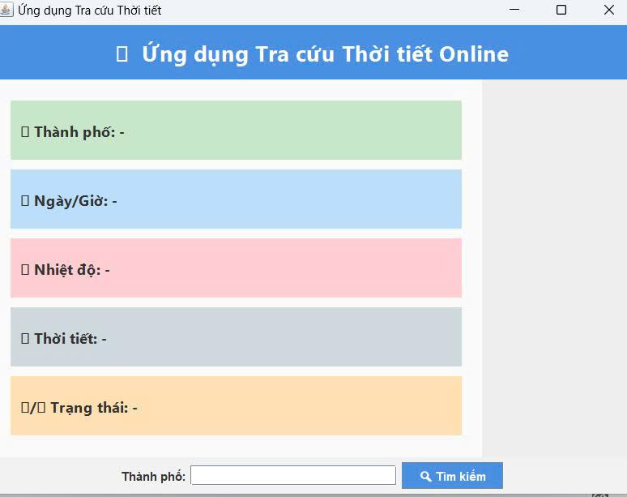
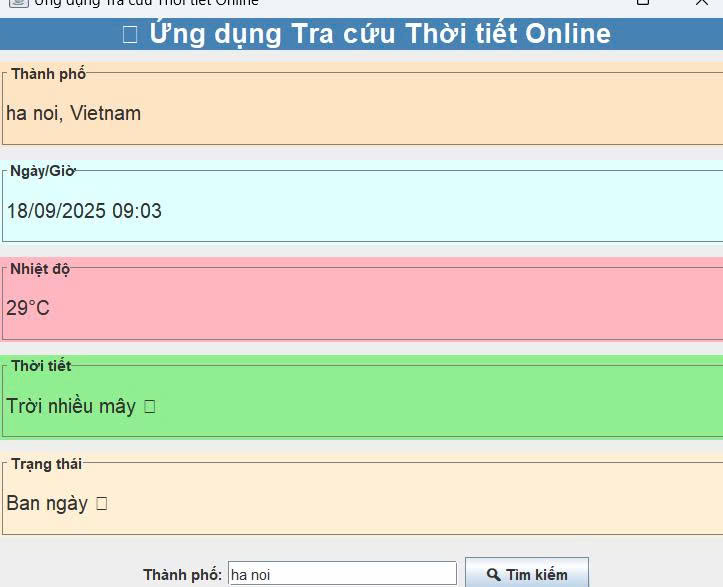
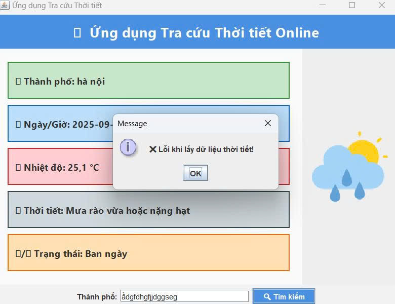

<h2 align="center">
    <a href="https://dainam.edu.vn/vi/khoa-cong-nghe-thong-tin">
        🎓 Faculty of Information Technology (DaiNam University)
    </a>
</h2>

<h2 align="center">
    Ứng dụng tra cứu thời tiết online
</h2>

<div align="center">
    <p align="center">
        
        
        
    </p>

[](https://www.facebook.com/DNUAIoTLab)
[](https://dainam.edu.vn/vi/khoa-cong-nghe-thong-tin)
[](https://dainam.edu.vn)

</div>

## 1. Giới thiệu hệ thống

🌦 Ứng dụng Tra cứu Thời tiết Online
📖 Giới thiệu đề tài

Trong thời đại công nghệ thông tin phát triển mạnh mẽ, nhu cầu nắm bắt thông tin thời tiết nhanh chóng và chính xác là rất cần thiết. Đề tài “Ứng dụng tra cứu thời tiết online” được xây dựng nhằm:

🏫 Minh họa mô hình Client – Server trong môn Lập trình mạng.

🌍 Kết nối và xử lý dữ liệu từ API OpenWeatherMap.

📱 Giúp người dùng nhập tên thành phố và nhanh chóng nhận được thông tin thời tiết.
📌 Giới thiệu dự án

Tên đề tài: Ứng dụng Tra cứu Thời tiết Online

Ngôn ngữ: Java

Chức năng chính:

Người dùng nhập tên thành phố.

Server gọi API OpenWeatherMap để lấy thông tin.

Hiển thị kết quả cho Client.
Ứng dụng vừa mang tính học tập, vừa có tính thực tiễn (tra cứu dữ liệu thời tiết thật).
👉 **Điểm nổi bật**:
- Người dùng có thể nhập tên thành phố và nhận thông tin thời tiết ngay lập tức
- Hỗ trợ nhiều thành phố trên toàn thế giới, dữ liệu cập nhật theo thời gian thực
- Giao diện client hiện đại với các thông báo trạng thái rõ ràng
## 🔧 2. Công nghệ & Ngôn ngữ sử dụng

[](https://www.java.com/)
[](https://docs.oracle.com/javase/tutorial/uiswing/)
[](https://www.weatherapi.com/)
[]()

**Chi tiết công nghệ:**
- **Java SE 11+**: Ngôn ngữ lập trình chính
- **Java Swing**: Xây dựng giao diện người dùng
- **Socket Programming**: Giao tiếp Client-Server qua TCP
- **HTTP Client**: Kết nối với WeatherAPI.com
- **JSON Parsing**: Xử lý dữ liệu JSON từ API (custom parser)
- **Multithreading**: ExecutorService cho xử lý đồng thời

## 🚀 3. Một số hình ảnh

### Giao diện chính của Client


### Kết quả tra cứu thời tiết
** Tra cứu thành công




## 📝 4. Các bước cài đặt

### Yêu cầu hệ thống:
- Java Development Kit (JDK) 11 trở lên
- IDE: Eclipse, IntelliJ IDEA, hoặc VS Code
- Kết nối internet (để truy cập WeatherAPI)

### Cài đặt và chạy:

. **Cấu hình API Key** (tùy chọn):
   - Đăng ký tài khoản tại [WeatherAPI.com](https://www.weatherapi.com/)
   - Thay thế API key trong `Server.java`:

🔄 Luồng chạy của chương trình

Khi chạy chương trình WeatherAppUI trong Eclipse:

Người dùng nhập thành phố

Người dùng gõ tên thành phố vào ô nhập liệu.

Nhấn nút 🔍 Tìm kiếm.

WeatherAppUI gọi đến Service

Lớp WeatherAppUI sẽ gọi phương thức getWeather(city) của WeatherService.

Trong dự án, WeatherService là interface, và lớp WeatherServiceImpl là hiện thực.

WeatherServiceImpl liên lạc qua RMI

WeatherServiceImpl không trực tiếp trả về dữ liệu, mà sẽ gọi phương thức từ xa (RMI) đến Server để lấy thông tin thời tiết.

Server sẽ kết nối với API thời tiết (ví dụ OpenWeatherMap) để truy vấn dữ liệu theo thành phố.

Server xử lý & trả kết quả về Client

Server nhận yêu cầu từ Client (qua RMI).

Server gọi API, nhận JSON kết quả, rồi xử lý để lấy:

Tên thành phố & quốc gia 🌍

Ngày/Giờ 📅

Nhiệt độ 🌡️

Mô tả thời tiết ☁️

Trạng thái ngày/đêm 🌞🌙

Sau đó Server trả về Client (UI).

UI cập nhật giao diện

WeatherAppUI nhận dữ liệu trả về.

Cập nhật các thẻ thông tin (Label).

Hiển thị icon phù hợp (mưa, nắng, mây, đêm, tuyết...).
### Cấu trúc dự án:
```
DuaBaoThoiTiet/
│
├── src/
│   └── weather/
│       ├── WeatherAppUI.java        // Giao diện Swing (Client)
│       ├── WeatherService.java      // Interface định nghĩa RMI
│       ├── WeatherServiceImpl.java  // Hiện thực service (Server side)
│       ├── WeatherServer.java       // Chạy RMI server, bind service
│       └── WeatherClient.java       // Chạy client, kết nối tới server
│
├── icons/                           // Thư mục chứa icon hiển thị
│   ├── sunny.png
│   ├── rain.png
│   ├── cloud.png
│   ├── storm.png
│   ├── night.png
│   ├── snow.png
│   └── default.png
│
├── lib/                             // (nếu có) các thư viện ngoài
│
└── README.md                        // Tài liệu hướng dẫn cài đặt & chạy

```

## ✉️ 5. Liên hệ

**Tác giả**: Nguyễn Thế Vinh

📧 **Email**: vinhvh010204@gmail.com
🏫 **Trường**: Đại học Đại Nam - Khoa Công nghệ Thông tin  


---


